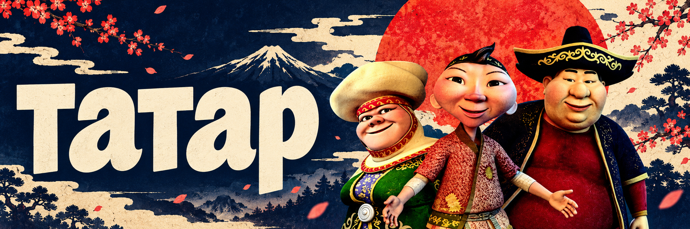

  

<h1 align="center">татар</h1>

<strong>コード · 創造 · 自由</strong> житомирские технологии

  <a href="https://github.com/heeuok?tab=repositories">Репозитории</a>
  &nbsp; / &nbsp;
  <a href="https://github.com/heeuok?tab=stars">Избранное</a>

